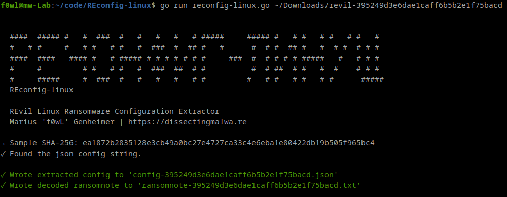
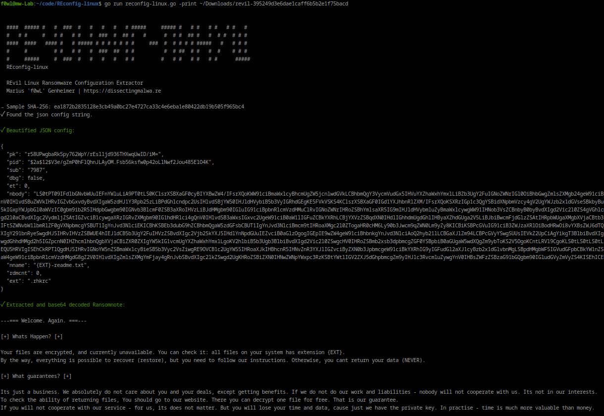

# REconfig-linux

REconfig-linux is a configuration extractor for the Linux variant of REvil Ransomware. It is capable of extracting the json config from the ELF file and decoding the ransomnote within it. By default the script will write the results to files in the current working directory, but you can also choose to print the config to stdout only by using the `-print` flag.

My Yara rule for the REvil Linux Ransomware can be found [here]().

A writeup by AT&T Alien Labs about this Ransomware variant can be found [here](https://cybersecurity.att.com/blogs/labs-research/revils-new-linux-version).

## Usage

```shell
go run reconfig-linux.go [-print] path/to/sample.elf
```

## Screenshots

### Non-verbose Mode



### Non-verbose Mode




## Configuration contents

The table below shows the keys used in the JSON configuration of Netwalker Ransomware. 

|             Key             |                     Value / Purpose                     |
| :-------------------------: | :-----------------------------------------------------: |
|           pk                |                Base64 encoded Public Key                |
|           sub               |                  Affiliate identifier                   |
|           dbg               |                Debug / Development Mode                 |
|           nbody             |                Base64 encoded Ransomnote                |
|           nname             |                Filename of the Ransomnote               |
|           rdmcnt            |           Currently unknown integer (RandomCount?)      |
|           ext               |              File Extension (5 characters)              |